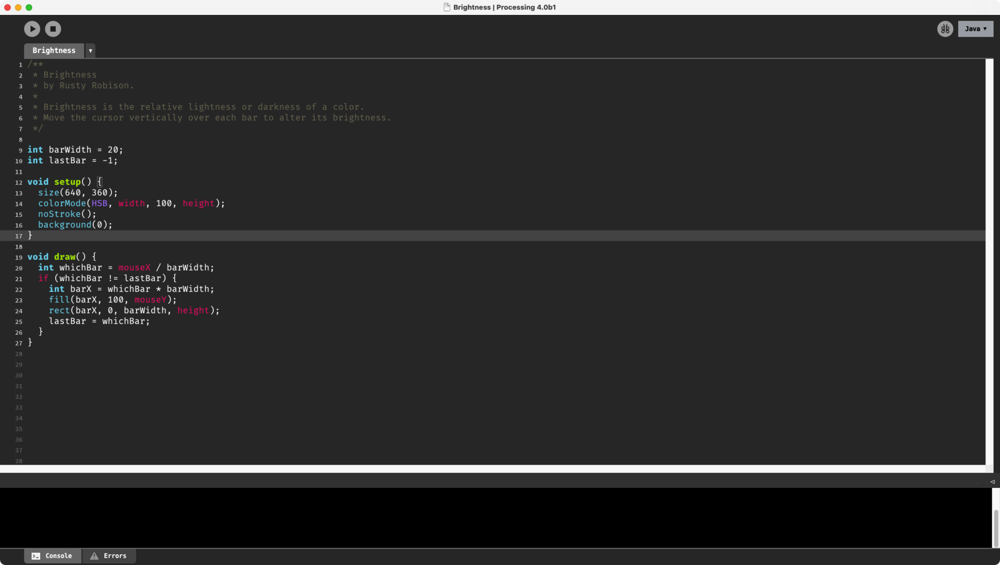

Dark Processing Theme (for 4.0)
===================

[中文说明](./README_CN.md)

A dark theme for the Processing IDE (a little easier on the eyes!) for Processing 4.0.

| Processing Version | Repo |
| :---- | :---- |
| 3.0 | [https://github.com/jeffThompson/DarkProcessingTheme_3.0](https://github.com/jeffThompson/DarkProcessingTheme_3.0) |
| 2.0 | [https://github.com/jeffThompson/DarkProcessingTheme_2.0](https://github.com/jeffThompson/DarkProcessingTheme_2.0) |
| 1.5 | [https://github.com/jeffThompson/DarkProcessingTheme](https://github.com/jeffThompson/DarkProcessingTheme) |


## CONTENTS  

* `status` folder: updated png files for the bottom bar where error messages show up, mostly to clean up the colors and get rid of the gradient. You don't have to move this folder if you don't want to.  
* `theme.txt`: where the magic happens! Somewhat annotated to make it easier to modify yourself  
* `README.md`: this file  
* `screenshot.png`: a screenshot of the theme

## INSTALLATION

Before installing anything, be sure to make a copy of the original in case you hate these changes or it breaks something! (If you do have issues, you can just re-install the Processing IDE again.) Just copy the files from this repo into the appropriate location.

* **Mac:** Go to the Processing app in your `Applications` folder, right click it and choose `Show Package Contents` and navigate to  `Java/lib`. Alternatively, just go to `~/Applications/Processing.app/Contents/Java/lib` from the Terminal.
* **Windows:** `%HomeDrive%\processing64\processing-3.2.1\lib\`  
* **Linux:** Go to the `lib` folder of the directory where you installed Processing, likely `~/processing-{{version-number}}`. Replace the original `footer`, `status` and `toolbar` folders with those in this repo and add the `theme.txt` folder.

## CodeHighlightTheme

In the `theme.txt`，we use `monokai` theme.

```sh
# monokai
editor.token.function1.style=#66D9EF,plain
editor.token.function2.style=#66D9EF,plain
editor.token.function3.style=#F92672,plain
editor.token.function4.style=#A6E22E,bold
editor.token.keyword1.style=#66D9EF,bold
editor.token.keyword2.style=#66D9EF,bold
editor.token.keyword3.style=#66D9EF,bold
editor.token.keyword4.style=#F92672,plain
editor.token.keyword5.style=#66D9EF,bold
editor.token.keyword6.style=#F92672,plain
editor.token.literal1.style=#E6DB74,plain
editor.token.literal2.style=#AE81FF,plain
editor.token.operator.style=#F92672,plain
editor.token.label.style=#999999,bold
editor.token.comment1.style=#75715E,plain
editor.token.comment2.style=#75715E,plain
editor.token.invalid.style=#F92672,bold#
```


----------------

Released under [Creative Commons BY-NC-SA license](http://creativecommons.org/licenses/by-nc-sa/3.0/)